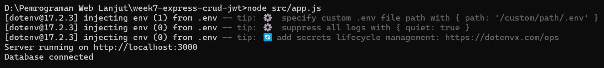
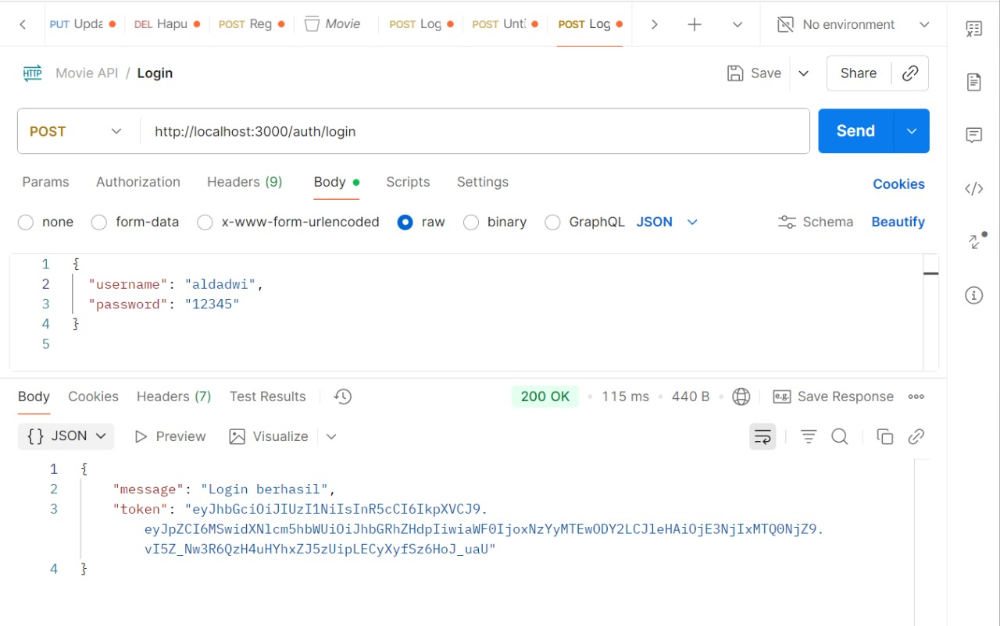
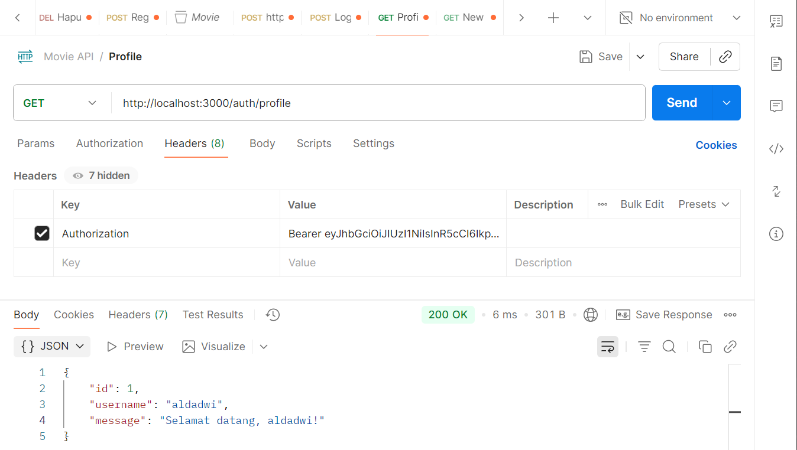
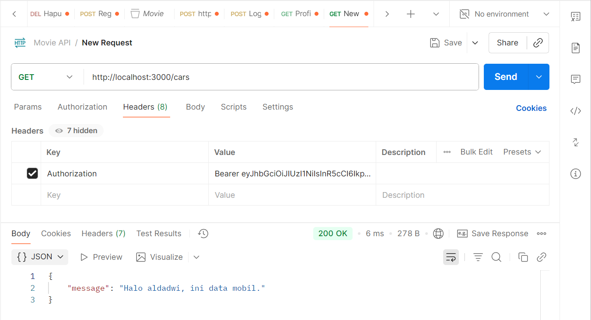
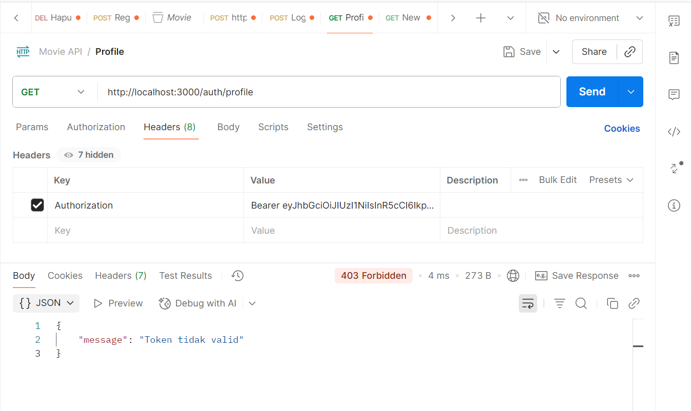

# week7-express-crud-jwt

## Identitas

- Nama : Alda Dwi Aprisagita
- NIM : F1D022032

---

## Tujuan Projek:

Tujuan dari proyek ini adalah untuk menerapkan sistem autentikasi user menggunakan JSON Web Token (JWT) agar hanya pengguna yang memiliki izin (login valid) yang bisa mengakses data atau endpoint tertentu di server. Melalui JWT, aplikasi dapat memastikan keamanan proses login, validasi token, dan pembatasan akses pada route tertentu.

## Teknologi yang Digunakan:

- Node.js : Platform runtime untuk menjalankan JavaScript di sisi server.
- Express.js : Framework utama untuk membuat REST API.
- MySQL2 : Database penyimpanan data user.
- bcrypt : Untuk hashing password secara aman sebelum disimpan.
- jsonwebtoken (JWT) : Untuk membuat dan memverifikasi token autentikasi.
- dotenv : Untuk menyimpan variabel rahasia (secret key) di file .env
- nodemon : Alat bantu untuk auto-restart server saat ada perubahan kode

## Struktur Folder:

week7-express-crud-jwt/
│
├── src/
│ ├── app.js # File utama server
│ ├── config/
│ │ └── db.js # Koneksi ke MySQL
│ ├── controllers/
│ │ └── authController.js # Logika register & login
│ ├── middleware/
│ │ └── authMiddleware.js # Middleware verifikasi token
│ ├── routes/
│ │ └── authRoutes.js # Route autentikasi
│ └── routers/
│ └── carRouter.js # Contoh route yang dilindungi JWT
├── .env # File berisi JWT_SECRET
├── package-lock.json
├── package.json
├── .gitignore
└── README.md

## Fitur yang Diimplementasikan:

- Register User : Menyimpan user baru ke database dengan password yang di-hash menggunakan bcrypt.
- Login User : Memverifikasi username & password, lalu mengembalikan token JWT.
- Middleware Autentikasi : Mengecek token yang dikirim client dan memverifikasi validitasnya.
- Route /profile : Menampilkan data user yang sedang login berdasarkan token.
- Expired Token (1 Jam) : Token JWT memiliki masa berlaku 1 jam (expiresIn: "1h").
- Route /cars : Hanya bisa diakses jika user sudah login dan token valid.

## Struktur Tabel Database

CREATE TABLE users (
id INT AUTO_INCREMENT PRIMARY KEY,
username VARCHAR(100) NOT NULL UNIQUE,
password VARCHAR(255) NOT NULL,
fullname VARCHAR(100),
job VARCHAR(100),
created_at TIMESTAMP DEFAULT CURRENT_TIMESTAMP
);

## Run Program

## Uji Coba Postman

- Daftar user baru : POST http://localhost:3000/auth/register
  

- Login dan dapatkan token JWT : POST http://localhost:3000/auth/login
  

- Tampilkan data user login (pakai token) : GET http://localhost:3000/auth/profile
  

- Akses route yang dilindungi middleware : GET http://localhost:3000/cars
  

- Token kadaluarsa setelah 1 jam :
  
